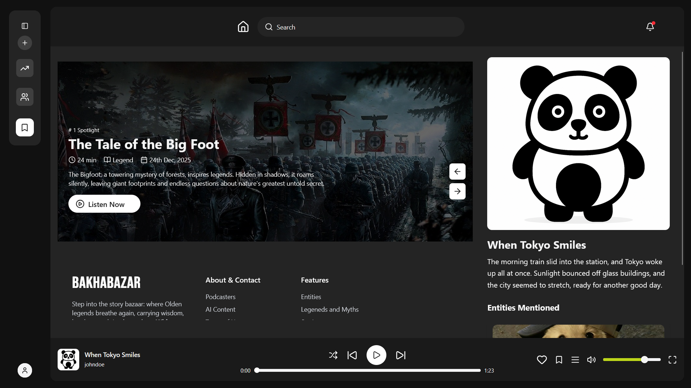

<h1 className="text-3xl md:text-4xl font-bold font-sans" align="center">BakhaBazar</h1>
<div align="center">

[](Collaborators.md#collaborators "Donate")

[](https://github.com/suyogprasai/bakhabazar/commits "Commit History")
[](https://github.com/suyogprasai/bakhabazar/pulse/monthly "Last activity")
</div>
<div align="center">
  

</div>

## Table of Contents

- [Introduction](#introduction)
- [Installation and Usage](#installation-and-usage)
- [Features](#features)
- [Installation](#installation)
- [Documentation](#documentation)
- [Tutorials](#usage-tutorials)
- [FAQ's](#common-faqs)
- [Contribution](#contribution)

## Introduction

**Bakhabazar** is a AI powered automated podcast social media system which allows for people to listen/ make create amazing stories with just a click of a button. We feature an amazing frontend UI built in NextJS + OpenAI powered text to speech, and speech to text features integrated into the system.  

<br><br>
[](https://youtu.be/s3P97ylnI3A)
<p align="center"><i>Click the image for video of the site</i></p>

# Our Features
Bakhabazar's main goal is to protect and conserve the local stories and legends spoken at streets of Kathmandu, focusing mainly on now forgetting lores and stories from different communities. We collect these stories,and we generate AI powered podcasts to broadcast them to the entire world.

## Key Functionalities

- **Human-Like Voice in Podcasts with emotions**  
  Generate expressive, natural-sounding podcasts using emotionally rich voice synthesis for immersive listening experiences.

- **Manual entry of Stories and Legends**  
  Create, edit, and publish original stories and legends with complete creative control and flexibility.

- **Complete Login and SignUp functionality**  
  Securely register, authenticate, and manage user accounts with reliable and seamless access controls.

- **Spotify-like audio control and features**  
  Enjoy intuitive audio playback with play, pause, seek, skip, and queue management features.

- **Social Media platform for interactivity between useres**  
  Facilitate user engagement through likes, comments, shares, follows, and interactive content discovery tools.

## Installation

To properly install Bakhabazar, you first need to download this repo in your computer, and also have npm installed. After doing that you need to clone the frontend repo using the script `./frontend.sh`. 

After which you need to add all the nescessary environemnt variables for the frontend and backend. And finally you need to setup n8n backend along with openAI api keys, and then do `docker compose up -d`

The installation procedure for this next js application is simple. You can follow the steps below to run a sample of this code in your machine. 
<brs>
> **Prerequesites**
> You need to make sure that you have node and npm installed in your local machine for running this, also make sure to have docker installed for running other componemts


  1. **Clone the Repository**
```bash
git clone https://github.com/suyogprasai/bakhabazar
```
2. **Install the Required Dependecies**
```bash
npm install
```
3. **Run the server on your Machine**
```bash
npm run dev
```

There are five things of which you need to be careful about during this installation. First, the two .env files for the Backend. Then the .env file for the frontend. And Finally, the docker_compose.yml and n8n configuration files. Each one of these components must be carefully considered, or you will likely run into an error.


Here is an example for how the .envs and other files are structured
```
.
├── bakhabazar/
│   ├── postgres_keys.env
│   ├── .env
│   └── ...other files
├── frontend/
│   └── .env
├── docker-compose.yml
└── n8n_config.json
```

For Development of frontend you need to turn off the frontend from the docker compose and run the fontend through npm directly. Also, make sure to access it with the webserver ( you may need to modify the docker compose ). We ran into a ton of errors for this one.


## Documentation

Bakhabazar is made primarily as a two server system with next js acting as the main frontend for the website with wordpress as the headless cms for content management of the site. This allows us for using proper management and segregation of the data and the system. 

<br/>


### Post Sync Plugin 

> [!IMPORTANT]
>Automatically syncs WordPress posts and user data with a Next.js server whenever a post or user is created, updated, deleted, or restored. Supports custom post types and includes secure API key integration for communication.

1. 🔁 **Auto Sync on Events**
It automatically syncs posts and users with a Next.js server on creation, update, deletion, or restoration—no manual actions required.

2. 🧠 **Supports Custom Post Types**
Built specifically for news, article, and announcement post types with tailored payload structures for each.

3. 🔐 **Secure Communication**
All sync requests use a secure API key in the header, ensuring only authorized connections with the Next.js server.

4. 📦 **Rich, Structured Payloads**
Sends detailed JSON data including titles, content, tags, images, author names, roles, and even custom ACF fields like position.

5. 🛠️ **Error Logging for Debugging**
Built-in logging via error_log() helps track sync events and quickly identify any issues during data transfer.

---
**The List of Plugins Being Used in the wordpress site is**
| Serial Number | Plugin Name                     | Version | Author                | 
|---------------|---------------------------------|---------|-----------------------|
| 1             | [Advanced Custom Fields](https://wordpress.org/plugins/advanced-custom-fields/)          | 6.3.12   | WP Engine             |
| 2             | [Classic Editor](https://wordpress.org/plugins/classic-editor/)                  | 1.6.7    | WordPress Contributors |
| 3             | [All-in-One WP Migration](https://wordpress.org/plugins/all-in-one-wp-migration/)         | 7.81     | ServMask              |
| 4             | [Members](https://wordpress.org/plugins/members/)                         | 3.2.18   | MemberPress           | https://wordpress.org/plugins/members/ |
| 5             | [Post and User Sync Plugin](https://github.com/SuyogPrasai/Bakhabazar_cms/releases/tag/Bakhabazar)       | 1.6.3     | Suyog Prasai          |Bakhabazar |
| 6             | [Ultimate Dashboard](https://wordpress.org/plugins/ultimate-dashboard/)              | 3.8.9    | David Vongries        |
| 7             | [White Label](https://wordpress.org/plugins/white-label/)                     | 3.2.1    | WPManageNinja         |
| 8             | [Widget Disable](https://wordpress.org/plugins/widget-disable/)                  | 2.0.1    | WpDevArt              | 
| 9             | [WP Custom Admin Interface](https://wordpress.org/plugins/wp-custom-admin-interface/)       | 7.9      | Martin Gibson         |

## Usage Tutorials
If you have any concerns exploring the full-scale usage of Bakhabazar, please kindly refer to our [YouTube page](https://www.youtube.com/@Bakhabazar_bnks) here. 
It consits of videos on how to use the entire website to the fullest. 


> [!IMPORTANT]
> Whether you have feedback on features, have encountered any bugs, or have suggestions for enhancements, we're eager to hear from you. Your insights help us make the Bakhabazar more robust and user-friendly.


## Common FAQ's

- **Does Bakhabazar require the user to sign in?** 
Signing in is really optional and its upto you! You won't need an account to view the general notices, but you will need to sign in (with a bnks domain id) specifically if you want to carry out actiivies like voting and polling.

- **Can Bakhabazar be accessed within school only?**
Well yes, Bakhabazar's website can only be accessed within school's intranet. However, if you are out of the boundries of school, you can subscribe to the newsletter on our website, which delivers the notices to you, no matter where you are in the world. 


- **Can Bakhabazar be accessed without a working internet conncetion?**
Absolutely, since Bakhabazar's server is hosted in the school's intranet, within the confines of school you could access it even when there is no working internet connection. Note however, that you still need to be connected to the internet even though is is not working.

**If you encounter and come across any sorts of issues be sure to contact us at:**
```bash
bnks.Bakhabazar.moderator@gmail.com
```

## Contribution

You can make pull requests to the repo and you should also follow the proper guidelines of github and the community for making the commits. Make sure to follow the code convention so far. The code will be reiviewed and if does good will be implemented in the system.
